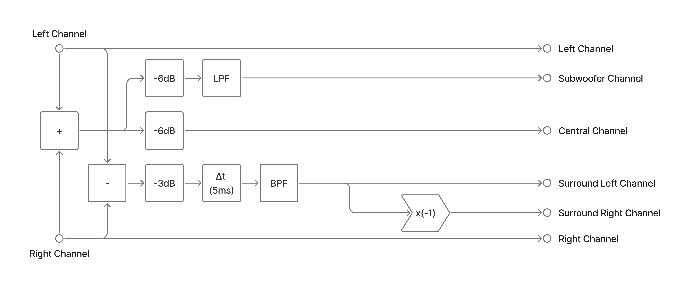
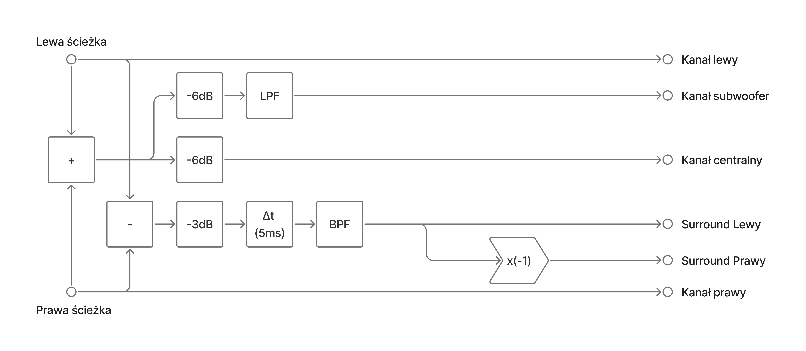

# Dolby Audio Decoder (Stereo to 5.1) - GUI
- [English Version](#english)
- [Polska Wersja](#polski)

---

## English
A simple desktop application that converts a stereo WAV file into 5.1-like channel stems using basic matrixing and filtering:
- Center: sum of L and R (with -6 dB damping)
- LFE: low-passed center (80 Hz, 3rd-order Butterworth)
- Surround L/R: band-passed (100–7000 Hz) L−R with 5 ms delay and phase inversion for the right surround

Built with Tkinter for the GUI and SciPy/NumPy for audio processing.

---

### Decoder scheme

The project implements the functionality shown in the following decoder diagram:



---

### Test results

Test WAV files are located in the `source/` directory.
Processing these files should produce channel amplitude results matching the table below.

|       | LF       | C        | RF       | LFE      | SL       | SR       |
|-------|----------|----------|----------|----------|----------|----------|
| Test1 | 1.000000 | 1.000000 | 1.000000 | 0.999893 | 0.000000 | 0.000000 |
| Test2 | 1.000000 | 0.000015 | 1.000000 | 0.000015 | 0.038980 | 0.038980 |
| Test3 | 0.999695 | 0.999695 | 0.999695 | 0.001504 | 0.000000 | 0.000000 |
| Test4 | 0.999695 | 0.000015 | 0.999695 | 0.000015 | 1.000000 | 1.000000 |
| Test5 | 0.997864 | 0.500015 | 0.999847 | 0.499954 | 0.500005 | 0.500005 |
| Test6 | 0.512604 | 0.359436 | 0.401581 | 0.124131 | 0.189746 | 0.189746 |

---

### Features
- Open a stereo WAV file via GUI
- Two modes:
    - Process Audio: saves per-channel WAV files to output/
    - Test filtration: displays channel amplitudes for inspection

- Supports common WAV sample formats: int16, int32, uint8, int8, float32/64
- Safe float conversion with clipping for floats to [-1.0, 1.0]

---

### Project structure
- main.py - GUI application (Tkinter), file I/O
- audio_processing.py - channel filtering and mixing
- conversion.py - WAV data-to-float conversion helpers
- output/ - generated WAV files (created on demand)
- source/ - source files containing test signals
- docs/ - decoder operation diagrams

---

### Requirements
- Python 3.13+
- Virtual environment (virtualenv)
- Packages: numpy, scipy
- OS: Windows, macOS, or Linux (GUI tested on standard desktop environments)

---

### Installation (recommended)
Create and use a virtual environment. Examples:
- Windows (PowerShell):

```
# Create venv
python -m venv .venv
# Activate
.venv\Scripts\Activate.ps1
# Install deps
pip install numpy scipy
```

- macOS/Linux (Bash):
```
# Create venv
python -m venv .venv
# Activate
source .venv/bin/activate
# Install deps
pip install numpy scipy
```

### Run
```
python main.py
```

---

### Usage
1. Launch the app.
2. Click “Browse” and select a stereo WAV file.
3. Choose one of:
    - Process Audio: generates per-channel WAVs into output/:
        - _left_front.wav
        - _right_front.wav
        - _center.wav
        - _lfe.wav
        - _left_surround.wav
        - _right_surround.wav

    - Test filtration: shows amplitude stats in the app without saving files.

Notes:
- Input must be stereo (2 channels). Mono or multichannel files will be rejected.
- Output files are int16 WAVs normalized from floating-point processing.

---

### Processing details
- Conversion: different integer/float formats normalized to float64
- Center: (L + R) × 0.5 × 0.5 (i.e., -6 dB)
- LFE: 3rd-order low-pass at 80 Hz (Butterworth)
- Surround (common for L/R):
    - Compute S = (L − R) × damping_3dB, where damping_3dB = sqrt(2)/2
    - Delay S by 5 ms
    - Band-pass 100–7000 Hz (2nd-order Butterworth)
    - Left surround = S_filtered
    - Right surround = -S_filtered (phase inversion)

---

### Troubleshooting
- “Audio is not stereo!”: Ensure your file has exactly 2 channels.
- “File not found”: Re-select the file; verify the path and access.
- No output files: Use “Process Audio” (not “Test filtration”), and verify you have write permissions to the project folder.

---

## Polski

Prosta aplikacja desktopowa, która konwertuje stereofoniczny plik WAV na zestaw kanałów w stylu 5.1, wykorzystując podstawowe miksowanie i filtrację:
- Center: suma L i R (z tłumieniem -6 dB)
- LFE: filtr dolnoprzepustowy centrum (80 Hz, Butterwortha 3. rzędu)
- Surround L/R: sygnał L−R po opóźnieniu 5 ms i filtracji pasmowej (100–7000 Hz), z odwróceniem fazy dla kanału prawego

GUI w Tkinter, przetwarzanie audio w SciPy/NumPy.

---

### Schemat dekodera

Projekt realizuje funkcjonalność przedstawioną na poniższym schemacie dekodera:



---

### Wyniki testowe

Pliki testowe WAV znajdują się w katalogu `source/`.
Ich przetworzenie powinno dać wyniki zgodne z poniższą tabelą amplitud kanałów.

|       | LF       | C        | RF       | LFE      | SL       | SR       |
|-------|----------|----------|----------|----------|----------|----------|
| Test1 | 1.000000 | 1.000000 | 1.000000 | 0.999893 | 0.000000 | 0.000000 |
| Test2 | 1.000000 | 0.000015 | 1.000000 | 0.000015 | 0.038980 | 0.038980 |
| Test3 | 0.999695 | 0.999695 | 0.999695 | 0.001504 | 0.000000 | 0.000000 |
| Test4 | 0.999695 | 0.000015 | 0.999695 | 0.000015 | 1.000000 | 1.000000 |
| Test5 | 0.997864 | 0.500015 | 0.999847 | 0.499954 | 0.500005 | 0.500005 |
| Test6 | 0.512604 | 0.359436 | 0.401581 | 0.124131 | 0.189746 | 0.189746 |

---

### Funkcje
- Wczytywanie pliku WAV w GUI
- Dwa tryby:
    - Process Audio: zapis kanałów do katalogu output/
    - Test filtration: podgląd amplitud bez zapisu

- Obsługa popularnych formatów danych WAV: int16, int32, uint8, int8, float32/64
- Bezpieczna konwersja float (z przycięciem do [-1.0, 1.0])

---

### Struktura projektu
- main.py - aplikacja GUI (Tkinter), I/O plików
- audio_processing.py - filtracja i miksowanie kanałów
- conversion.py - pomocnicze konwersje danych WAV do float
- output/ - wygenerowane pliki WAV (tworzone w razie potrzeby)
- source/ - pliki źródłowe zawierające sygnały testowe
- docs/ - schematy działania dekodera

---

### Wymagania
- Python 3.13+
- Środowisko wirtualne (virtualenv)
- Pakiety: numpy, scipy
- System: Windows, macOS lub Linux (GUI testowane na standardowych desktopach)

---

### Instalacja (zalecana)
Utwórz i używaj wirtualnego środowiska. Przykłady:
- Windows (PowerShell):

```
# Tworzenie środowiska
python -m venv .venv
# Aktywacja
.venv\Scripts\Activate.ps1
# Instalacja zależności
pip install numpy scipy
```

- macOS/Linux (Bash):

```
# Tworzenie środowiska
python -m venv .venv
# Aktywacja
source .venv/bin/activate
# Instalacja zależności
pip install numpy scipy
```

### Uruchomienie

```
python main.py
```

---

### Użycie
1. Uruchom aplikację.
2. Kliknij „Browse” i wybierz stereofoniczny plik WAV.
3. Wybierz jedną z opcji:
    - Process Audio: generuje osobne pliki WAV w katalogu output/:
        - _left_front.wav
        - _right_front.wav
        - _center.wav
        - _lfe.wav
        - _left_surround.wav
        - _right_surround.wav

    - Test filtration: wyświetla amplitudy kanałów w aplikacji bez zapisu plików.

Uwagi:
- Wejście musi być stereo (2 kanały). Pliki mono lub wielokanałowe są odrzucane.
- Pliki wyjściowe zapisywane są jako WAV int16 po znormalizowaniu sygnału float.

---

### Szczegóły przetwarzania
- Konwersja: różne formaty liczb całkowitych i zmiennoprzecinkowych normalizowane do float64
- Center: (L + R) × 0.5 × 0.5 (czyli -6 dB)
- LFE: filtr dolnoprzepustowy 80 Hz (Butterworth 3. rzędu)
- Surround (wspólne kroki dla L/R):
    - S = (L − R) × damping_3dB, gdzie damping_3dB = sqrt(2)/2
    - Opóźnienie S o 5 ms
    - Filtr pasmowy 100–7000 Hz (Butterworth 2. rzędu)
    - Left surround = S_po_filtracji
    - Right surround = -S_po_filtracji (odwrócenie fazy)

---

### Rozwiązywanie problemów
- „Audio is not stereo!”: Upewnij się, że plik ma dokładnie 2 kanały.
- „File not found”: Ponownie wybierz plik; sprawdź ścieżkę i uprawnienia.
- Brak plików wyjściowych: Użyj „Process Audio” (nie „Test filtration”) i upewnij się, że masz prawa zapisu do folderu projektu.
